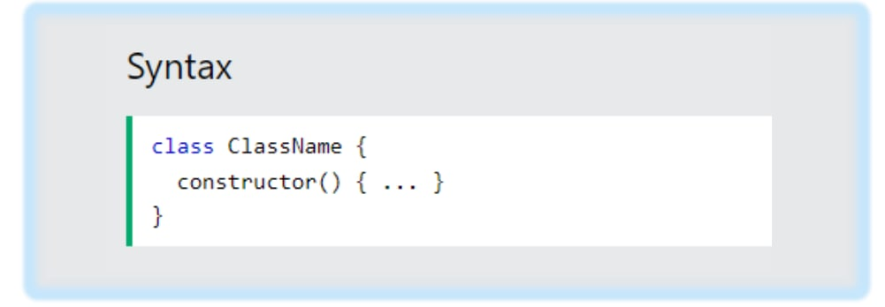
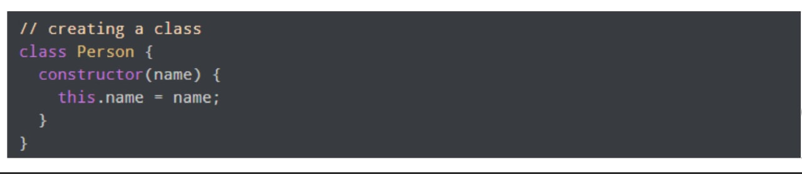
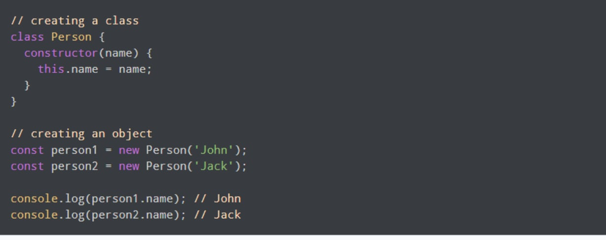
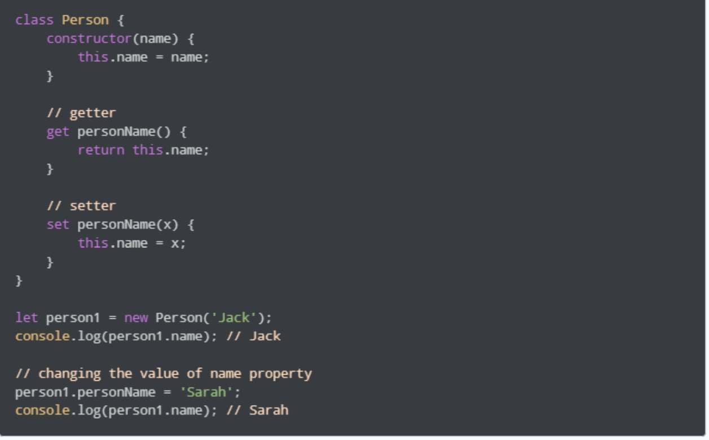

# POP-1111

# _____________Class______________
## What is it ?
#### ECMAScript 2015, also known as ES6, introduced JavaScript Classes.
#### JavaScript Classes are templates for JavaScript Objects.
#### Always add a method named constructor():
#### Use the keyword class to create a class.

# class
#### A class is a blueprint for the object. You can create  an object from the class.
#### Шумо метавонед синфро ҳамчун эскиз (прототип) тасаввур кунед хона. Он дорои тамоми тафсилот дар бораи ошёнаҳо, дару тиреза ва гайра Дар асоси ин тавсифхо шумо хона месозед. Хона объект аст.
#### Чунки аз ҳамин хел хонаҳои зиёде сохтан мумкин аст тавсиф, мо метавонем объектҳои зиёде аз а синф.

# Эҷоди синфи JavaScript
#### Синфи JavaScript ба функсияи созандаи Javascript монанд аст ва он танҳо як қанди синтаксисист. Функсияи созанда чунин муайян карда мешавад

#### Ба ҷои истифодаи калимаи функсия, шумо калимаи калидии class for -ро истифода мебаред сохтани синфҳои JS. Барои намуна,

####  Калимаи калидии class барои сохтани синф истифода мешавад. Хусусиятҳо таъин карда мешаванд дар функсияи созанда
#### шумо метавонед объект кунед. барои намуна

#### Дар ин ҷо, person1 ва person2 объектҳои синфи Person мебошанд
 Эзоҳ: Усули конструктор () дар дохили синф даъват карда мешавад
ба таври худкор хар дафъае, ки объект сохта мешавад

# Усулҳои синфи Javascript: Гирандагон ва Танзимкунандагон
#### Дар JavaScript усулҳои getter арзиши объектро мегиранд усулҳои танзимкунанда арзиши объектро муқаррар мекунанд
####  Синфҳои JavaScript метавонанд гирандаҳо ва танзимкунандаҳоеро, ки шумо истифода мебаред, дар бар гиранд калимаи калидии get барои усулҳои getter ва танзим барои усулҳои танзимкунанда. Барои мисол
